# ForgePulse — Predictive Maintenance & OEE Command Center

**Snowflake CoCo CLI Hackathon 2026 — Predictive Maintenance and OEE Command Center**

A factory's machines stream sensor data into Snowflake. ForgePulse watches that
stream autonomously: it detects developing faults days before failure,
investigates the root cause against the plant's own repair history — including
scanned handwritten reports — creates the work order with parts and a
production-aware schedule, and shows a supervisor everything on a live deployed
console, with the projected OEE impact of acting early.

**Deployed console:** `https://eq3xntb-vqyueyo-cgb78487.snowflakecomputing.app`
(Snowflake login required; served by Snowpark Container Services from inside the
submission account)

**Mirror (build account, live through ~26 Oct 2026):**
`https://eqhfgtb-xsjwiso-mib54927.snowflakecomputing.app`

> Both links run on 30-day hackathon trial accounts; the primary expires ~1 Nov 2026. First load takes 2–3 minutes while the SPCS compute pool
> resumes from idle. The system is fully reproducible from this repo —
> `docs/redeploy.md` plus `sql/08_load.sql` bring an empty account to a running
> console in about an hour. Happy to redeploy on request.

**Demo video:** `<VIDEO_URL>`

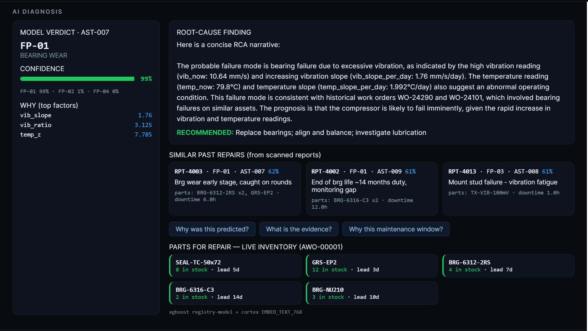

---

## The doctrine

> **Rules own safety. Retrieval owns grounding. The model owns reasoning.**

Every layer of ForgePulse follows this split:

- **Deterministic rules** decide what is a fault, what severity it carries, and
  what tier of action follows. No model can override the stuck-sensor floor or
  dispatch parts for an instrumentation error.
- **Retrieval** grounds every explanation: the RCA narrative may only cite
  numbers that exist in query results, and fleet history comes from actual work
  orders and actual scanned repair reports found by semantic search.
- **Models reason on top**: a registered XGBoost classifier adds pattern
  probability and explainable factors; Cortex COMPLETE writes the narrative from
  the evidence dossier; a vision model reads the scanned paperwork.

## Architecture

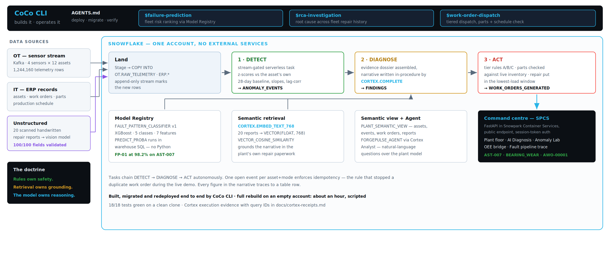

## What happens, end to end

1. **Stream** — a Kafka producer emits 4 sensors × 12 assets every 5 seconds; a
   consumer lands batches in `OT.RAW_TELEMETRY`. A Snowflake **stream** marks
   the new rows.
2. **Detect (autonomous)** — a serverless **task** fires every minute, but only
   spends compute when the stream has data. The detection **procedure** computes
   engineered features (z-scores against each asset's own 28-day baseline,
   slopes, variance collapse, vibration→temperature lag correlation) and opens
   an `ANOMALY_EVENTS` row with a fault-pattern ID. Idempotency: one open event
   per asset+mode — an ACTIONED event blocks re-alerting (a rule added after the
   autonomous DAG itself surfaced the duplicate-alert bug; see
   `tests/test_idempotency.py`).
3. **Diagnose (autonomous)** — the next task in the DAG assembles the evidence
   dossier (features that fired, asset context, matching fleet work-order
   history) and writes a finding. `SNOWFLAKE.CORTEX.COMPLETE` turns the dossier
   into a structured narrative **inside the stored procedure**: Observed →
   Probable cause → Supporting history → Urgency. Strict grounding: every number
   in the text traces to a table row.
4. **Enrich (explainability)** — a worker computes the same features the
   classifier was trained on, runs the **Model Registry** classifier for pattern
   probability, extracts SHAP top factors, embeds the symptoms and retrieves the
   most similar past repairs from the scanned-report corpus by **VECTOR cosine
   similarity — the search runs inside Snowflake**.
5. **Act (autonomous)** — tier rules create the work order: parts checked
   against `SPARE_PARTS_INVENTORY`, the repair scheduled into the lowest-load
   window in `PRODUCTION_SCHEDULE`, notification logged. Sensor faults (FP-03)
   never dispatch parts.
6. **Show** — the deployed console renders it all.

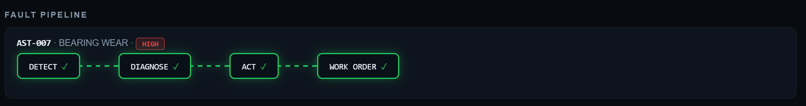

## The console

Twelve assets across three lines. Healthy is green, the machine in trouble is
not — and the moment you select it, everything the system knows about it is on
one screen.

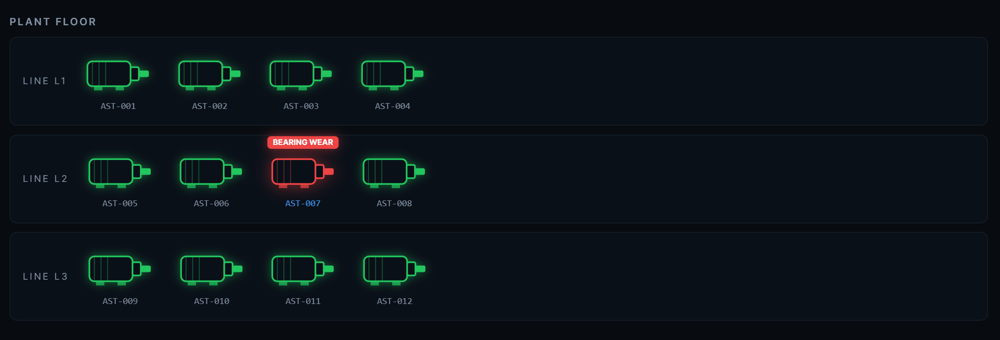

The live monitor drives its display envelope from real values against real
baselines: AST-007 sits at 11.95 mm/s RMS against a 3.41 mm/s baseline.

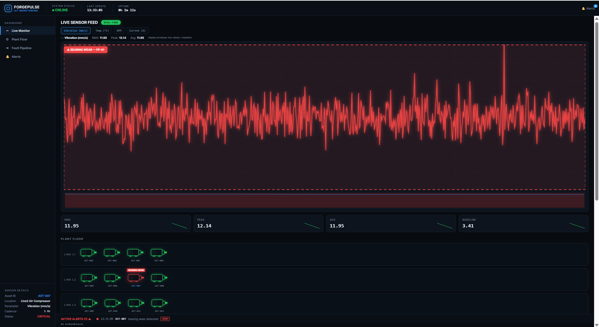

**A note on alerts.** Active alerts are a sticky ticker pinned to the bottom of
the viewport, visible at every scroll position — the NOC pattern from BRD §8:
calm until something isn't. The sidebar *Alerts* entry anchors to that section;
because the ticker is always on screen, that link is intentionally a no-op jump
rather than a navigation.

## The Anomaly Lab — inject and detect

A synthetic signal with the same physics as the training data, with one fault
injected into a known segment. The registered classifier runs over 18-hour
sliding windows; the ground-truth bracket is drawn underneath so the call can be
checked against the truth rather than taken on trust.

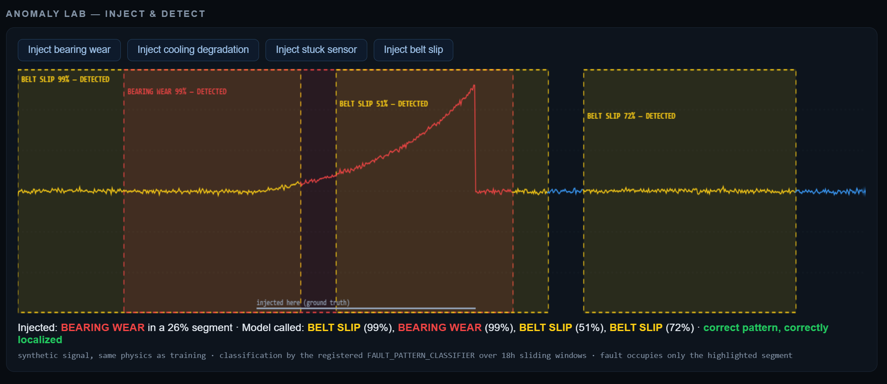

Several overlapping windows fire on one injection, and they do not all agree.
That is the real behaviour of a sliding-window classifier and it is shown as-is
— the verdict line reports every window's call, not just the flattering one.

## The document layer

Twenty scanned, handwritten repair reports (generated with jitter, rotation, and
scan noise; ground truth in `reports/reports_index.csv`) are read by a local
vision model and validated field-by-field: **100/100 key fields correct.** The
extracted rows live in `EXTRACTED_REPORTS`; each report is embedded by
`SNOWFLAKE.CORTEX.EMBED_TEXT_768('snowflake-arctic-embed-m', …)` into a
`VECTOR(FLOAT, 768)` column, searched with `VECTOR_COSINE_SIMILARITY` in plain
SQL (`sql/07_embed_reports.sql`). Fleet learning made visible: a new fault on one
machine cites its siblings' repair paperwork.

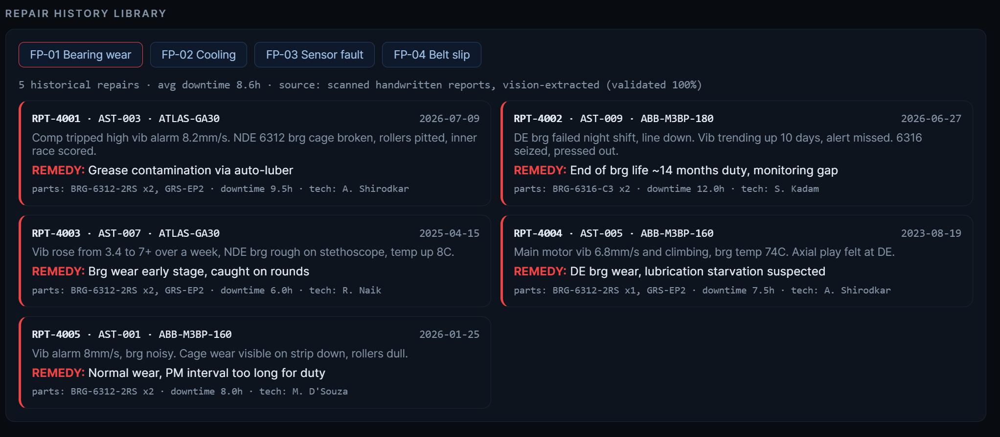

## The classifier — an honest MLOps story

The fault classifier (XGBoost, 5 classes, registered in the **Model Registry** as
`FAULT_PATTERN_CLASSIFIER`) initially misfired in serving: 99% confident of belt
slip on a textbook bearing fault. Eight documented iterations followed — feature
train/serve skew, RPM regime mixture from production-schedule speed changes,
distribution shift from saturated faults the training sim never contained,
severity miscalibration — each diagnosed with evidence (per-class feature means
vs live values) and fixed at the root.

Final state: serving features computed with the exact training formulas; RPM
features excluded (documented data-regime limitation — FP-04 detection remains
rule-layer); the model agrees with the rule layer at **98.2%** on AST-007, served
natively via `FAULT_PATTERN_CLASSIFIER!PREDICT_PROBA` with no Python at inference
time. The rules were the safety floor the whole time. The full arc is in the
session receipts.

## CoCo CLI as the deployment agent

The entire system was deployed to this account **by CoCo in agentic sessions** —
schema, 1.24M-row load with verified counts, streams, procedures, task DAG, fault
catalog, Cortex-native diagnosis, model registration, SPCS service.

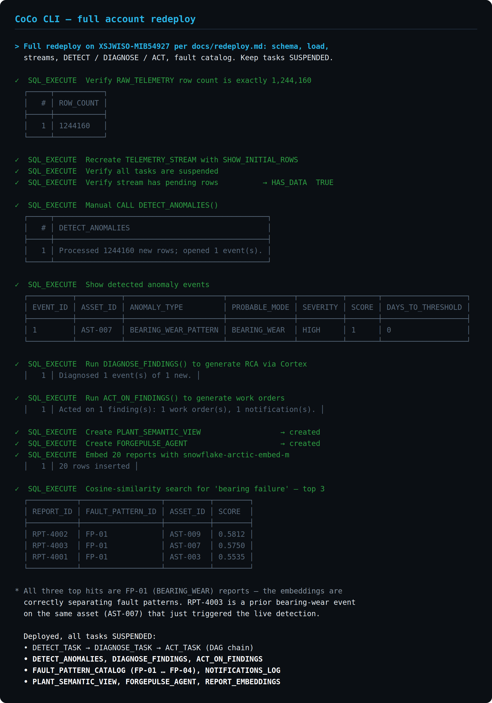

Three custom **Agent Skills** let CoCo operate the plant conversationally, and
the same three were used to build and verify it.

**`$rca-investigation`** — reasons across the detection features, the Cortex
narrative and the scanned report corpus, and finds a prior bearing event on the
same compressor.

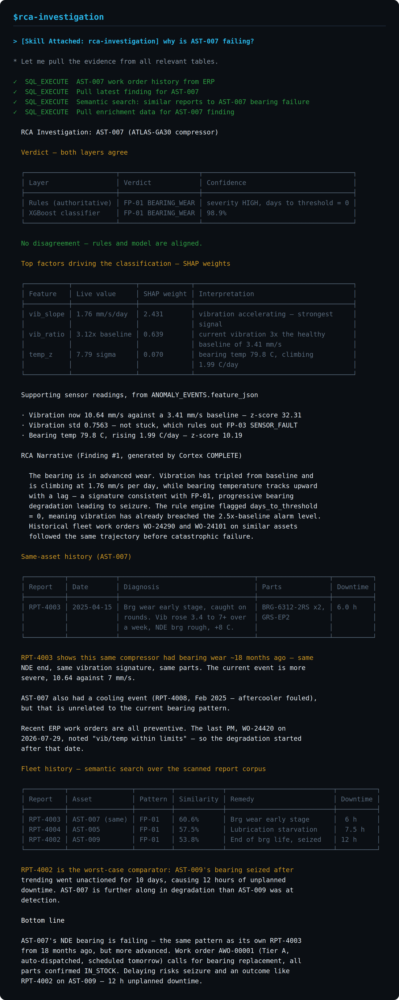

**`$failure-prediction`** — scores all twelve assets through the Model Registry
and separates what is actionable from what is noise, saying so plainly.

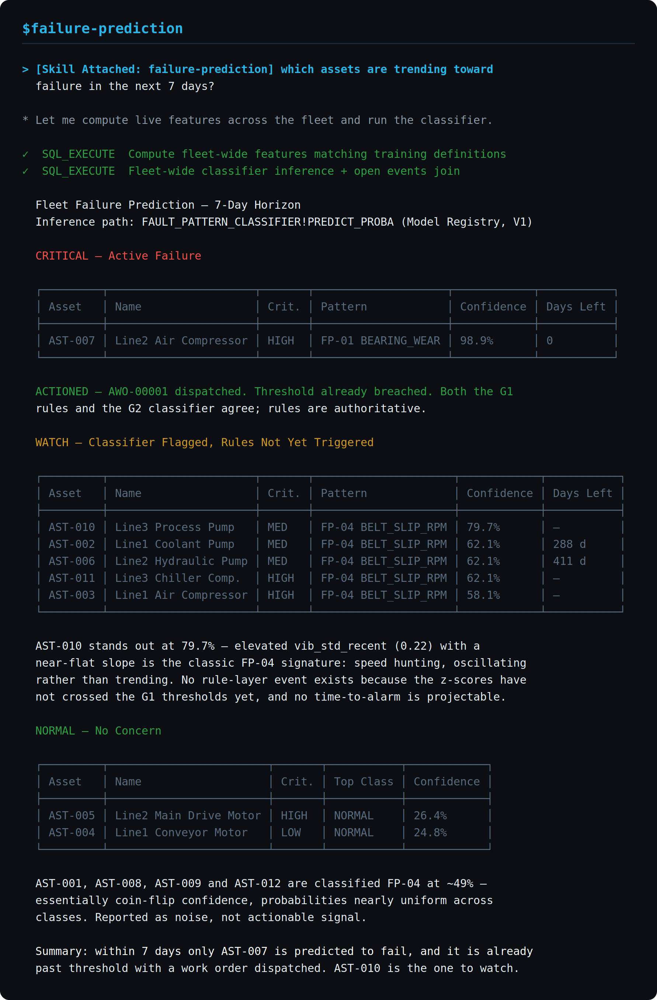

**`$work-order-dispatch`** — asked to raise a duplicate order, it declined,
citing the idempotency rule by name, and returned the existing one with its full
dispatch rationale. A skill refusing to act because a rule forbids it is the
doctrine working, not a failure.

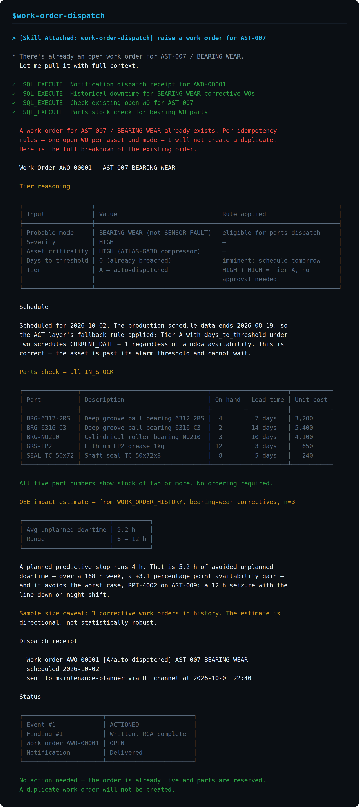

Session receipts — prompts, approvals, incidents and self-corrections, including
CoCo detecting its own over-firing delete against a known-good count and
recovering by clean reload — are in `docs/coco-sessions/`.

## Snowflake services used

Warehouses · Stages + PUT/COPY · Streams · Serverless Tasks (chained DAG) ·
Stored Procedures · Cortex AISQL (`COMPLETE`, `EMBED_TEXT_768`) · VECTOR datatype
+ vector similarity functions · Resource Monitors · Snowpark (Session +
snowflake-ml) · Model Registry · Image Repository · Compute Pools · Snowpark
Container Services (public endpoint) · Semantic Views · Cortex Agents ·
Notebooks (managed Python) · CoCo CLI (deployment agent + custom Agent Skills)

## Cortex — gated for a month, native at the end

`SNOWFLAKE.CORTEX.COMPLETE`, `EMBED_TEXT_768`, Cortex Search, Document AI
runtime, and `DATA_AGENT_RUN` returned *"not available for trial accounts"* on
every account class this hackathon provided for most of the build — verified
across four accounts including two created through dedicated hackathon links,
with query IDs on the support ticket. The model-role grant path
(`CORTEX-MODEL-ROLE-ALL`) was also tested: the gate sat above it. ForgePulse was
therefore architected as **Cortex-native definitions with local adapters at
runtime**, and shipped that way for six weeks.

The organizers' AI Data Cloud flow lifted the gate in the final week. The
submission account runs **Cortex natively**: RCA narratives are generated
in-procedure by `CORTEX.COMPLETE('llama3.1-70b', …)` against the evidence
dossier, and the twenty-report corpus is embedded by
`CORTEX.EMBED_TEXT_768('snowflake-arctic-embed-m', …)` into `VECTOR(FLOAT, 768)`
and searched with `VECTOR_COSINE_SIMILARITY` — retrieval end to end inside the
account, no local model in the loop.

The adapters remain in the repo as the documented fallback
(`src/llm_worker.py`, `src/embed_reports.py`) for any account where the gate
still applies, and document extraction still runs through local qwen2.5-vl
(validated 100%). Built honest under constraint; swapped to native the day the
door opened.

Execution evidence with Snowflake query IDs:
[`docs/cortex-receipts.md`](docs/cortex-receipts.md).

## Repository map

```
sql/            01_schema … 08_load — the account, reproducible
src/            generators, kafka pipe, workers, extraction, embedding,
                training, enrichment
forgepulse-ui/  FastAPI backend (Snowflake-backed + mock) + console +
                Dockerfile/spec for SPCS
scripts/        run.ps1 orchestrator (-Feed -Worker -Ui -All), env template,
                deploy.py (SQL runner + stage/verify, CoCo-free path),
                register_classifier.py, fleet_predict.py
skills/         CoCo agent skills
tests/          18-test pytest suite (feature math, extraction validation,
                API contract, idempotency regression)
reports/        scanned corpus + ground truth + extracted fields
docs/           BRD, redeploy runbook, SPCS runbook, Cortex receipts,
                session receipts, screenshots
```

## Run it

```powershell
# one-time: python -m venv .venv ; pip install -r requirements.txt
# copy scripts\env.example.ps1 -> scripts\env.ps1 and fill credentials
.\scripts\run.ps1 -All        # kafka + producer + consumer + workers + console
pytest                        # 18 tests, green on a clean clone
```

Full account redeploy from empty: `docs/redeploy.md` — rehearsed four times,
roughly one hour via a single CoCo prompt, or via `scripts/deploy.py` where the
CoCo CLI is unavailable.

---

*Built solo by Mrinal Prakash Desai for the Snowflake CoCo CLI Hackathon 2026.*


